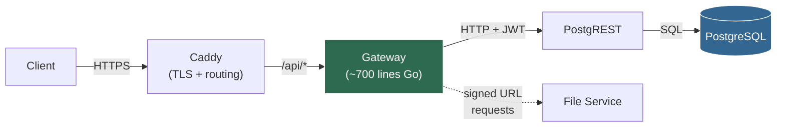
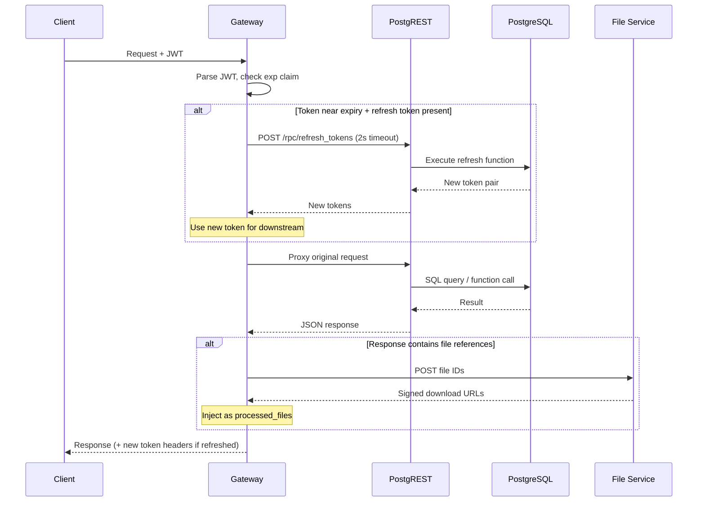

# The Gateway: A Thin, Replaceable Proxy

## Role

The gateway is a reverse proxy that sits in front of PostgREST. It has exactly two responsibilities:

1. **Best-effort token refresh** — transparently refresh expiring JWTs before the request hits PostgREST
2. **Response enrichment** — inject signed file URLs into responses that reference stored files

It contains **zero business logic**. All auth validation, all data operations, all decisions live in PostgreSQL. The gateway is a UX convenience layer — nothing more.

---

## Why It's Thin (~700 Lines of Go)

The gateway exists because PostgREST doesn't handle two specific edge concerns:

- **Automatic token refresh before expiry.** Without the gateway, clients must track token expiration themselves and refresh proactively. The gateway does this transparently so clients can fire-and-forget.
- **Injecting signed URLs from an external file service.** Without the gateway, clients receive file IDs and must call a separate service to resolve them into download URLs. The gateway folds this into the response.

Both are UX enhancements. Neither is business logic. If you removed the gateway entirely, the system would still work — clients would just need to refresh tokens themselves and fetch file URLs with a separate call. That's the litmus test: **can you remove this service and lose nothing but convenience?** The gateway passes.

The implementation reflects this simplicity. Standard library HTTP, a JWT parser, and a handful of functions. No framework, no dependency injection, no middleware chain. Seven hundred lines including error handling, logging, and health checks.

---

## Architecture

The gateway sits between the reverse proxy (Caddy) and PostgREST. It intercepts requests on the way in and responses on the way out. The file service is a side channel, called only when a response needs URL enrichment.

The dashed line to the file service is intentional — it's an optional, best-effort call. If the file service is unreachable, the response is returned unchanged.

---

## Request Flow

Every request through the gateway follows the same six-step path:

1. Client sends a request with a JWT in the `Authorization` header
2. Gateway parses the token (without full validation — just reads the `exp` claim)
3. If the token is within the refresh threshold and a refresh token is present: preflight refresh with a 2-second timeout
4. Proxy the request to PostgREST, using the new token if one was issued
5. Inspect the response body — if it contains a `files` array, enrich with signed URLs from the file service
6. Return the response to the client, including new token headers if a refresh occurred

---

## Token Refresh: Best-Effort, Never Blocking

The refresh logic is deliberately optimistic. It tries to help; it never gets in the way.

**How it works:**

- Parse the JWT without full cryptographic validation — the gateway only needs the `exp` claim to decide whether a refresh is worthwhile. PostgREST handles real validation downstream.
- If the token expires within the configured threshold (e.g., 60 seconds) and a refresh token is present in the request headers: fire a `POST` to PostgREST's `/rpc/refresh_tokens` endpoint.
- The refresh call has a hard **2-second timeout**. If it doesn't complete in time, the gateway proceeds with the original token as if nothing happened.
- On success: the new access token is used for the downstream PostgREST call, and both new tokens are returned to the client in response headers.
- On failure (timeout, invalid refresh token, network error): the original token is used. No error is surfaced. The client's request proceeds normally.

The gateway never blocks a request waiting for a refresh. If the refresh races and loses, the worst case is the client gets one more response with the old token — and the next request will try again.

---

## Response Enrichment: File URLs

When PostgreSQL returns data that references stored files, the raw response contains file IDs — opaque identifiers that aren't useful to a client without a subsequent API call. The gateway eliminates that round-trip.

**How it works:**

- After receiving a response from PostgREST, the gateway inspects the JSON body for a `files` array field
- If present: extract file IDs and `POST` them to the file service
- The file service returns signed download URLs with expiration times
- The gateway injects these as a `processed_files` field in the response body
- If the file service returns an error, times out, or is unreachable: the original response is returned unmodified

The enrichment is invisible to PostgREST and PostgreSQL. They return file references as they always would. The gateway layers on convenience without altering the contract.

---

## Error Philosophy: Fail Safe, Never Block

Every enhancement the gateway provides is wrapped in error recovery. The principle is simple: **the gateway must never make a request worse than it would have been without the gateway.**

| Scenario | Behavior |
|---|---|
| Token refresh times out | Proceed with original token |
| Token refresh returns an error | Proceed with original token silently |
| File service is unreachable | Return original response unchanged |
| File service returns malformed data | Return original response unchanged |
| Gateway itself crashes | Caddy returns 502; client retries directly or via PostgREST |

There is no failure mode where the gateway corrupts data, blocks indefinitely, or returns a misleading error. It either improves the response or leaves it untouched. This is what makes it safe to remove entirely — it's additive by construction.

---

## Why This Service Is Replaceable

The gateway is designed to be thrown away. Every architectural choice reinforces this:

- **Zero state.** No sessions, no cache, no in-memory data structures that survive a request. Every request is independent. You can kill the process mid-request and lose nothing.
- **No business logic.** Every authorization decision, every data transformation, every state transition lives in PostgreSQL. The gateway doesn't know what a "user" is or what "permissions" mean — it just forwards tokens.
- **Minimal dependencies.** Standard library HTTP server, a single JWT parsing library. No ORM, no framework, no configuration DSL.
- **Mechanical behavior.** The gateway doesn't decide *whether* to refresh — the token is either near expiry or it isn't. It doesn't decide *what* to enrich — the response either has a `files` field or it doesn't. There are no heuristics, no feature flags, no conditional paths based on business rules.

You could replace this with:

- **Nginx + a Lua script** — `access_by_lua` for token refresh, `body_filter_by_lua` for response enrichment
- **A Cloudflare Worker** — same logic at the edge, closer to the client
- **Nothing at all** — clients handle token refresh and file URL resolution themselves

The system's correctness doesn't depend on the gateway. Its convenience does.

---

## PostgREST Does the Heavy Lifting

It's worth emphasizing what the gateway *doesn't* do, because PostgREST handles all of it automatically:

- **Route mapping.** Database schema structure becomes HTTP endpoints — tables, views, and functions are exposed without explicit route definitions.
- **Content negotiation.** JSON, CSV, and binary responses based on `Accept` headers.
- **Pagination and filtering.** Query parameters map directly to SQL clauses — range headers for pagination, query operators for filtering.
- **JWT-based role switching.** PostgREST reads the `role` claim from the JWT and sets the PostgreSQL session role accordingly. Row-level security takes over from there.
- **OpenAPI schema generation.** A complete API specification is generated from the database structure, always in sync because it *is* the database structure.

The gateway's only job is to make the experience slightly better for clients that don't want to manage token lifecycle or resolve file URLs manually.

---

## Configuration

The gateway is configured entirely through environment variables. There are no config files, no admin endpoints, no runtime toggles.

| Variable | Purpose |
|---|---|
| `POSTGREST_URL` | Upstream PostgREST address (e.g., `http://postgrest:3000`) |
| `FILE_SERVICE_URL` | File service endpoint for signed URL resolution |
| `JWT_SECRET` | Secret used to *parse* (not validate) tokens — reads the `exp` claim only |
| `REFRESH_THRESHOLD_SECONDS` | How close to expiry a token must be to trigger a refresh (e.g., `60`) |

Four variables. No secrets management beyond the JWT secret. No feature flags. The gateway does the same thing every time, for every request, with no conditional configuration. That predictability is the point.
