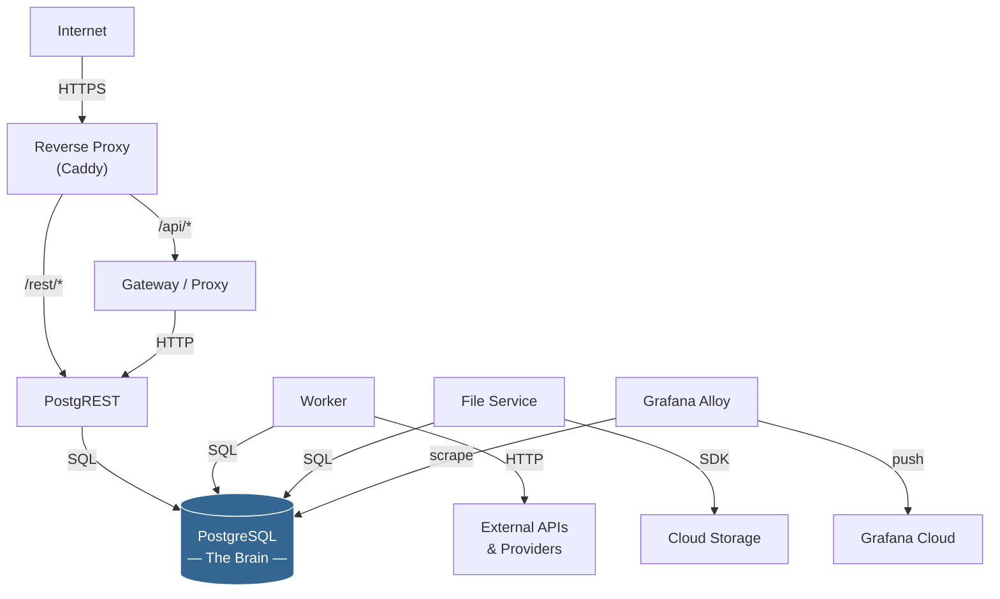
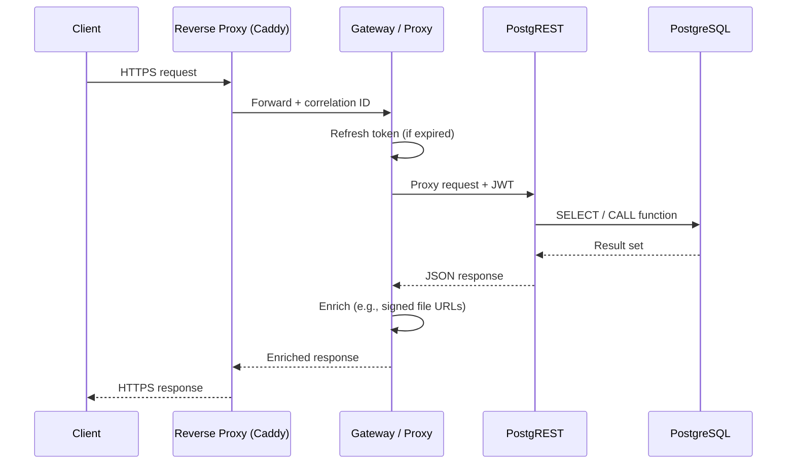
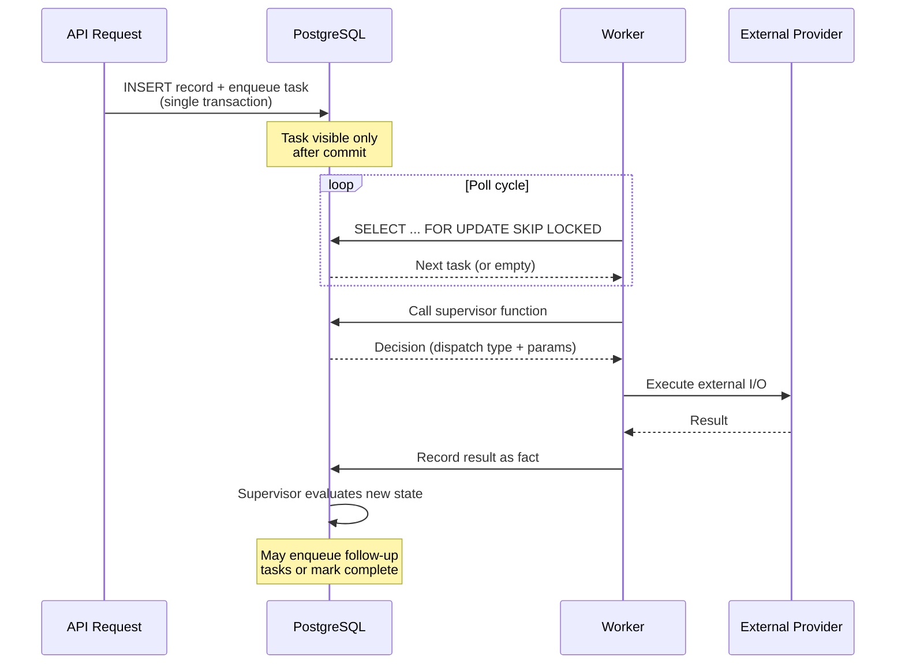

# System Architecture

## Overview

A database-first system has a distinctive shape. PostgreSQL sits at the center — not as a dumb data store, but as the *brain* — surrounded by thin, stateless services whose only job is to translate protocols. HTTP arrives, gets translated into a function call. A background task fires, gets translated into external I/O. The result is recorded back in the database.

If you drew a dependency graph, every arrow points inward toward PostgreSQL. No service talks to another service. No service holds state. This is the defining architectural property: **the database is the single source of truth, logic, and coordination.**

---

## Component Map

Every component in the system falls into one of two categories: *the database* or *a translator that talks to the database*.

| Component | Role | Lines of code | Business logic? |
|---|---|---|---|
| **PostgreSQL** | Schema, constraints, functions, RLS policies, state machines, scheduling | N/A (it's the platform) | **All of it** |
| **PostgREST** | Auto-generates a REST API from the database schema | 0 (off-the-shelf) | None |
| **Gateway / Proxy** | Reverse proxy for edge concerns — token refresh, response enrichment | ~700 | None |
| **Worker** | Dequeues tasks, dispatches to database functions or external providers | ~500 | None |
| **File Service** | Generates signed URLs for cloud storage uploads/downloads | ~300 | None |
| **Caddy** | TLS termination, routing, request correlation IDs | Config only | None |
| **Grafana Alloy** | Ships logs and metrics to Grafana Cloud | Config only | None |

The pattern is stark. Thousands of lines of SQL encode every rule, every permission, every state transition. The surrounding services are measured in hundreds of lines each, and they make zero decisions.

---

## The "Database Out" Design Process

Building a feature in a database-first system follows a consistent sequence:

**1. Start with the schema.** Model your domain as tables, constraints, and functions. Define what's *possible* before defining how it's *accessed*. A well-constrained schema prevents entire categories of bugs at the lowest layer.

**2. Expose via PostgREST.** Your schema *is* your API. Create a view or function, grant permissions to the appropriate role, and PostgREST serves it as a REST endpoint. No controllers, no serializers, no route files.

**3. Add workers for async.** When a synchronous request needs to trigger external work — sending an email, calling a third-party API, processing a file — it enqueues a task in the same transaction that records the intent. Workers poll for tasks and execute them. The database supervises; workers just do I/O.

**4. Thin services for edge concerns.** Some things don't fit cleanly into a request/response cycle: token refresh before a request reaches PostgREST, enriching a response with a signed file URL. A thin proxy handles these. It's stateless, replaceable, and optional.

---

## Data Flow

### Synchronous Request Flow

A typical API request never leaves the PostgreSQL boundary for its core logic. The services it passes through are protocol translators — nothing more.

Every step outside PostgreSQL is mechanical. The gateway doesn't decide *whether* to refresh a token — the token is either expired or it isn't. It doesn't decide *what* to enrich — the response schema tells it. Decisions live in the database.

### Background Job Flow

Async work follows a supervisor pattern. The database holds the state machine; workers provide hands.

The critical property: **the worker contains no conditional logic**. It doesn't decide what to do next — it asks the database, which returns a concrete instruction. If the worker crashes mid-task, the lock is released and another worker picks it up. The database's transactional guarantees make this safe without any application-level retry logic.

### File Upload Flow

File uploads avoid streaming large payloads through the API. The system creates an *intent*, then the client uploads directly to cloud storage.

1. Client calls the API to create an upload intent
2. PostgreSQL records the intent and returns metadata
3. The gateway enriches the response with a signed upload URL from the file service
4. Client uploads directly to cloud storage using the signed URL
5. A completion webhook or polling confirms the upload
6. PostgreSQL records the file as available

The API never touches file bytes. The file service never touches business logic.

---

## Infrastructure Topology

The deployment model is deliberately simple:

- **Single Docker bridge network.** All containers share one network. No overlay networking, no service mesh.
- **Container-name discovery.** Services find each other by container name — `postgres`, `postgrest`, `gateway`. No service registry.
- **Single internet-facing port.** Only Caddy binds to the host network. Every other service is internal-only.
- **Cascading health checks.** PostgreSQL must be healthy before PostgREST starts. PostgREST must be healthy before the gateway starts. Caddy routes only to healthy upstreams. A single `docker compose up` brings everything up in the correct order.

Two compose files cover every environment: one for production, one for development (which adds hot-reload, debug ports, and seed data). Make targets wrap every operation — `make deploy`, `make migrate`, `make logs` — so the full operational surface is discoverable from the Makefile.

---

## Key Design Decisions

### Why No Separate Message Broker?

PostgreSQL with `FOR UPDATE SKIP LOCKED` provides exactly the job queue semantics this architecture needs: atomic enqueue-with-business-data, transactional delivery guarantees, and visibility into queue state with plain SQL.

Adding Redis, RabbitMQ, or Kafka introduces a second source of truth, a second failure mode, and a second thing to monitor — for zero benefit at single-host scale. If the system outgrows PostgreSQL's queue throughput (thousands of jobs per second), a dedicated broker becomes justified. Until then, it's operational complexity without a corresponding problem.

### Why PostgREST Instead of a Custom API?

The database schema *is* the API contract. Every table, view, and function with the right grants becomes an endpoint automatically. PostgREST eliminates thousands of lines of CRUD boilerplate — controllers, serializers, validators, route definitions — that would otherwise exist only to shuttle data between HTTP and SQL.

Row-level security means access control is enforced at the database level, not in application middleware. A misconfigured endpoint can't leak data because the database won't return rows the caller isn't allowed to see. The security boundary is as low as it can possibly be.

### Why the Gateway is Replaceable

The gateway has zero state and zero business logic. Its two jobs — refresh expired tokens and enrich responses with signed URLs — are pure functions of their inputs.

You could replace it with Nginx and a Lua script. You could replace it with a Cloudflare Worker. You could remove it entirely, and clients would simply lose automatic token refresh and file URL enrichment — features they could handle themselves.

This is the litmus test for every service in the architecture: **if removing it would lose business logic, it shouldn't exist.** The gateway passes this test. The business logic lives where it belongs — in PostgreSQL.

### Why Docker Compose, Not Kubernetes

Single-host simplicity. Two compose files, a Makefile, and `ssh` cover deployment, rollback, logs, and debugging. There is no scheduler to configure, no ingress controller to maintain, no YAML sprawl to manage.

Kubernetes solves real problems — multi-host orchestration, automatic failover, rolling deploys across fleets. But adopting it before those problems exist means paying the complexity cost without receiving the benefits. Docker Compose gets out of the way. When the system genuinely needs horizontal scaling, the stateless services are already containerized and ready to move. The database-first architecture makes that migration straightforward because there's only one stateful component to consider: PostgreSQL itself.
