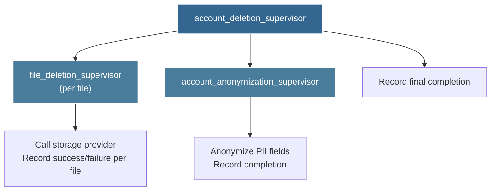
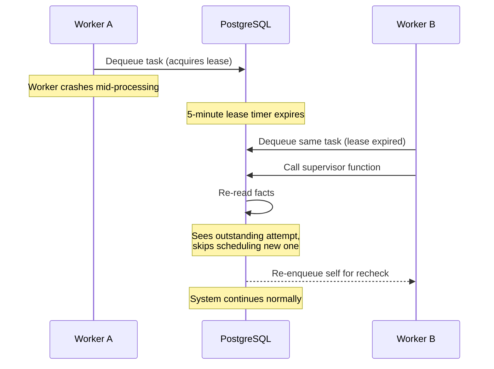

# Supervisors and Background Processing

## The Big Idea

In most systems, background processing means a job queue: enqueue a job, a worker picks it up, the job runs to completion or fails. Retries are bolted on. State lives in the queue. Observability means tailing logs and hoping.

Database-first systems work differently. The **supervisor** — a plain SQL function — is the brain. It reads facts from the database, makes a decision, and writes effects. The worker is a dumb pipe that polls for tasks, executes I/O, and records results. It contains no conditional logic. It makes no decisions.

This is the fundamental inversion: **the database orchestrates; processes just provide hands.**

A supervisor doesn't "process a job." It evaluates the current state of a workflow — how many attempts have been made, whether any succeeded, how long since the last failure — and decides what to do next. That decision is a pure function of recorded facts.

---

## Why Not Redis, Sidekiq, or Bull?

Traditional job queues introduce a second source of truth. The business data lives in your database. The job metadata lives in Redis. Now you have two systems that must agree, two things that can fail independently, and two places to look when something goes wrong.

With a database-first queue, you get:

- **Transactional consistency.** The business record and the task that processes it are created in the same transaction. If the transaction rolls back, neither exists. No orphaned jobs. No phantom work.
- **Total observability.** `SELECT * FROM queues.task WHERE task_type = 'send_email' AND status = 'pending'` shows you everything. No specialized CLI tools, no admin dashboards, no guessing.
- **Single source of truth.** There is no synchronization problem because there is nothing to synchronize.
- **Debuggability.** Call the supervisor's facts function in production. See exactly what the supervisor sees. No side effects. Pure diagnostic power.

---

## The Facts → Logic → Effects Pattern

Every supervisor follows three phases. This structure isn't a suggestion — it's a discipline that makes supervisors testable, debuggable, and safe to run concurrently.

### Phase 1: Facts

Gather all information the supervisor needs to make a decision. This is a read-only query with no side effects. It answers questions like: Has this workflow succeeded? How many attempts have failed? Is there an outstanding attempt in progress?

### Phase 2: Logic

Make a decision based purely on the facts. No database writes. No external calls. Just branching on the data.

### Phase 3: Effects

Perform writes — schedule a new attempt, re-enqueue the supervisor for a future check, or do nothing if the workflow is complete.

Here's a concrete example — a supervisor that orchestrates sending an email with retries:

```sql
create or replace function comms.send_email_supervisor(_payload jsonb)
returns jsonb language plpgsql security definer as $$
declare
  _task_id bigint := (_payload->>'send_email_task_id')::bigint;
  _facts record;
  _max_attempts integer := 3;
begin
  -- Lock the root record to prevent concurrent supervisor runs
  perform 1 from comms.send_email_task
  where send_email_task_id = _task_id for update;

  -- FACTS: gather current state
  _facts := comms.send_email_supervisor_facts(_task_id);

  -- LOGIC + EFFECTS: decide and act
  if _facts.has_success then
    return '{"status": "succeeded"}'::jsonb;
  end if;

  if _facts.num_failures >= _max_attempts then
    return '{"status": "max_attempts_reached"}'::jsonb;
  end if;

  if _facts.num_attempts = _facts.num_failures then
    perform comms.schedule_email_attempt(_task_id);
  end if;

  perform comms.schedule_supervisor_recheck(_task_id, _facts.num_failures);
  return '{"status": "scheduled"}'::jsonb;
end;
$$;
```

Read the logic carefully. The supervisor doesn't track state in memory. It reads facts, branches, and writes effects. If it runs twice with the same facts, it produces the same outcome. If it runs after a crash, it picks up exactly where things stand. This is the core property that makes the pattern resilient.

---

## The Facts Function: Your Diagnostic Tool

The facts function is the most valuable piece. It's a stable, read-only query that returns everything the supervisor needs to know:

```sql
create or replace function comms.send_email_supervisor_facts(
  _task_id bigint,
  out has_success boolean,
  out num_failures integer,
  out num_attempts integer
) language sql stable as $$
  select
    comms.has_send_email_succeeded_attempt(_task_id),
    comms.count_send_email_failed_attempts(_task_id),
    comms.count_send_email_attempts(_task_id);
$$;
```

This function is marked `stable` — it has no side effects. You can call it in production any time to see exactly what the supervisor would see. When an email is stuck, you don't read logs. You run:

```sql
select * from comms.send_email_supervisor_facts(42);
```

And you immediately know: has it succeeded? How many failures? How many total attempts? The debugging surface is a SQL query, not a treasure hunt through distributed logs.

---

## The Worker: A Dumb Pipe

The worker process is deliberately simple. It has one loop and no decisions:

1. Poll `queues.dequeue_next_available_task()` every few seconds
2. Route by `task_type` to the appropriate processor
3. Execute the work
4. Record the result

For **database function** tasks, the worker calls `internal.run_function(name, payload)` — it invokes whatever SQL function the task specifies and records the return value. The worker doesn't know or care what the function does.

For **provider tasks** (email, SMS, webhooks), the worker follows a three-step protocol:

1. Call the **before handler** — a database function that returns the data needed for the API call
2. Call the **external API** with that data
3. Call the **success handler** or **error handler** depending on the result

The worker always marks the task as completed, whether the outcome was success or failure. This is critical: **retries come from supervisors creating new tasks, not from re-processing old ones.** Every task runs exactly once. Every attempt is a separate, auditable record.

---

## Supervision Trees

Simple workflows need a single supervisor. Complex, multi-step workflows use **supervision trees** — supervisors that monitor other supervisors.

Consider account deletion, which requires deleting files across a storage provider, anonymizing personal data, and recording the final result:



The root supervisor polls child state. It doesn't receive signals or callbacks. It runs periodically, queries the facts — how many files are deleted, has anonymization completed — and decides what to do.

Key principles of supervision trees:

- **Parent polls child state.** No event-driven coordination, no callbacks, no race conditions. The parent asks "what's true right now?" and acts accordingly.
- **Children are independent and reusable.** The file deletion supervisor doesn't know it's part of account deletion. It can be used anywhere files need deleting.
- **Ordering is irrelevant.** The parent can run before, during, or after its children — the facts-based approach always produces the correct decision. There's no "missed event" problem.
- **Each level handles its own retries.** The file deletion supervisor manages its own retry logic. The parent doesn't retry on behalf of children — it just checks whether they're done.

---

## Exponential Backoff

When a supervisor needs to recheck later, it schedules itself with exponential backoff. Failed attempts space out retries to avoid hammering an already-struggling external service:

```sql
_next_check_at := now()
  + (_base_delay * power(2, _num_failures))
  * interval '1 second';

perform queues.enqueue(
  'db_function',
  _supervisor_payload,
  _next_check_at
);
```

With a base delay of 5 seconds: the first retry fires after 5 seconds, the second after 10, the third after 20. The backoff is a function of recorded failures, so it's deterministic and inspectable — you can calculate the next check time from the facts alone.

---

## Idempotency by Construction

Supervisors don't need careful idempotency logic bolted on as an afterthought. The pattern makes idempotency structural:

- **`ON CONFLICT DO NOTHING`** on all terminal fact inserts. Recording a success twice is harmless — the second insert is silently ignored.
- **`FOR UPDATE`** on root records prevents concurrent supervisor runs from double-scheduling attempts.
- **Facts-based decisions** mean running the same supervisor twice with the same data produces the same outcome. There's no mutable state to corrupt.
- **Run count protection** (a configurable maximum, typically 20 runs) prevents infinite loops. If a supervisor has run 20 times without reaching a terminal state, something is genuinely wrong — and the system surfaces that explicitly rather than spinning forever.

---

## Crash Recovery

The crash recovery story is where this pattern earns its keep. There is no special recovery code. The system self-heals through normal operation:



Walk through it step by step:

1. Worker A dequeues a task and acquires a time-limited lease
2. Worker A crashes mid-processing
3. The 5-minute lease expires — PostgreSQL considers the task available again
4. Worker B dequeues the same task
5. The supervisor re-reads facts, sees there's an outstanding attempt with no recorded result
6. It skips scheduling a new attempt (one is already in flight or lost) and re-enqueues itself for a later recheck
7. On the next recheck, if the attempt was truly lost, the supervisor sees all attempts have results and schedules a fresh one

No checkpointing. No journaling. No distributed coordination. The database survived the crash, and the facts tell the supervisor everything it needs to resume correctly.

---

## Exception Philosophy: Let It Crash

Supervisors follow an Erlang-inspired exception philosophy: **code for the happy path and let failures propagate.**

A provider call throws an exception? Good — the error handler records the failure as a fact, and the supervisor decides whether to retry. A database function hits an unexpected state? The task fails, the supervisor sees the failure count increment, and it either retries or gives up.

The supervisor acts as a **fence**. Errors don't propagate beyond it. They're caught, recorded, and factored into the next decision. This means individual components can be simple — they don't need defensive error handling for every edge case.

A system that crashes noisily and recovers automatically is more reliable than one that silently continues in a bad state. Silent corruption is the enemy. A failed task with a recorded error is a solved problem — you can see it, query it, alert on it, and fix the root cause. A task that "succeeded" but did the wrong thing is an invisible disaster.

---

## Adding a New Background Process

Every new background workflow follows the same recipe:

**1. Model the domain.** Create a root task table and an attempts table. The root task represents the *intent* ("send this email"). Each attempt represents a *try* ("attempted at 3:42 PM, failed with timeout").

**2. Write fact helpers.** Small, composable SQL functions: `has_succeeded_attempt()`, `count_failed_attempts()`, `count_attempts()`. These are your building blocks.

**3. Write the supervisor.** Follow Facts → Logic → Effects. Gather facts, branch on them, write effects. Keep it under 50 lines.

**4. Register handlers.** Wire up the before handler (returns data for the API call), the success handler (records the success fact), and the error handler (records the failure fact).

**5. Configure grants.** Supervisors use `SECURITY DEFINER` to run with elevated permissions. Grant `EXECUTE` on the supervisor and handler functions to the worker's database role.

The result is a background workflow that's fully visible, fully debuggable, self-healing on crash, and idempotent by construction — built from nothing more than tables, functions, and a dumb worker polling a queue.
