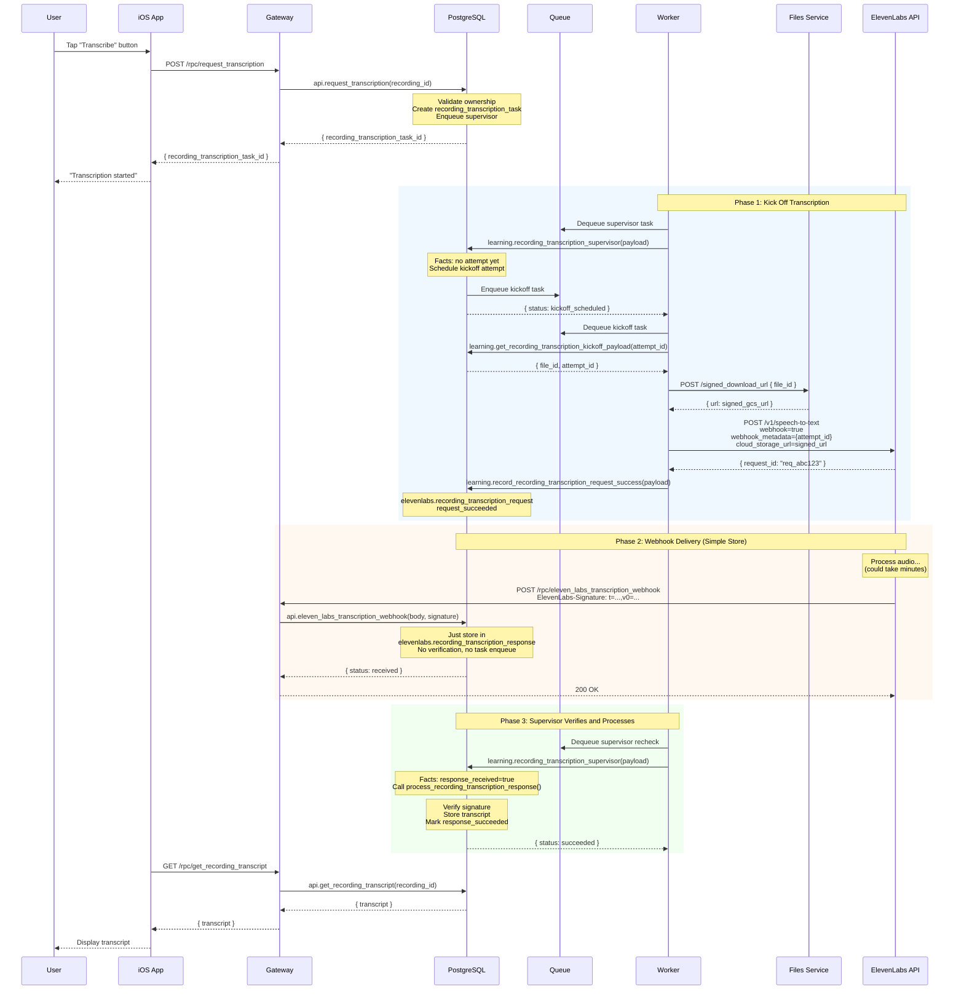

# Recording Transcription Research

Status: research complete
Date: 2026-01-31
**Last Updated: 2026-02-01** (Added verified implementation details from testing)

## Executive Summary

This document outlines the design for transcribing user audio recordings using the ElevenLabs Speech-to-Text API. The feature will allow users to request transcription of their recordings on-demand, with results stored per recording. The implementation follows existing supervisor and worker patterns.

**Key Decisions:**
- Use **asynchronous** ElevenLabs API calls with **webhooks** (audio files can be 30+ minutes)
- Webhook security follows the **Stripe pattern**: save raw payload + signature without auth, verify in separate task
- Transcription triggered **on user request** via API endpoint
- Store full transcript text + word-level JSONB data
- Supervisor manages the entire flow: kick off, wait for webhook, process result

## 🔴 Critical Implementation Details (TESTED & VERIFIED)

**These details are CRITICAL for signature verification to work:**

### 1. PostgREST Function Parameter Type
**Use `JSON` parameter (not JSONB or TEXT):**
```sql
CREATE FUNCTION api.eleven_labs_transcription_webhook(JSON) RETURNS JSONB ...
```

- ❌ **JSONB** - Normalizes JSON (removes spaces, reorders keys) → breaks signatures
- ❌ **TEXT** - PostgREST returns 404 with `Content-Type: application/json`
- ✅ **JSON** - Preserves exact formatting → signatures work!

### 2. PostgreSQL HMAC Function
**Use text version directly (no `convert_to()`):**
```sql
-- CORRECT (matches Python hmac exactly)
encode(hmac(message_text, secret_text, 'sha256'), 'hex')

-- WRONG (produces different results)
encode(hmac(convert_to(message_text, 'UTF8'), convert_to(secret_text, 'UTF8'), 'sha256'), 'hex')
```

### 3. PostgREST Header Access
**Headers stored as JSON object:**
```sql
-- CORRECT
current_setting('request.headers', true)::json->>'elevenlabs-signature'

-- WRONG (doesn't work)
current_setting('request.header.elevenlabs-signature', true)
```

### 4. Schema Cache
**After changing function signatures, restart PostgREST or send `SIGUSR1` signal.**

Otherwise PostgREST won't find the updated function (404 errors).

### 5. Testing Signature Verification BEFORE Building Full System

**Verify HMAC compatibility first:**

```python
# Python test
import hmac
from hashlib import sha256
result = hmac.new('secret'.encode('utf-8'), 'test'.encode('utf-8'), sha256).hexdigest()
print(result)  # Should match SQL
```

```sql
-- PostgreSQL test (must produce identical result)
SELECT encode(hmac('test', 'secret', 'sha256'), 'hex');
```

**If these don't match, stop!** Fix HMAC before continuing - signature verification will never work.

**Minimal test migration available:** See `postgres/migrations/1738454400_elevenlabs_webhook_minimal.sql` for a standalone webhook endpoint + signature verification that can be tested independently before building the full supervisor system.

---

## 1. ElevenLabs Speech-to-Text API Analysis

### Endpoint

```
POST https://api.elevenlabs.io/v1/speech-to-text
```

### Authentication

```
Header: xi-api-key: <ELEVENLABS_API_KEY>
```

The worker already has access to `ELEVENLABS_API_KEY`.

### Key Parameters

| Parameter | Value | Purpose |
|-----------|-------|---------|
| `model_id` | `scribe_v2` | Latest model with best accuracy |
| `cloud_storage_url` | GCS signed URL | URL to audio file (not file upload) |
| `webhook` | `true` | Enable async processing |
| `webhook_metadata` | `{"attempt_id": 123}` | Correlation ID for matching response |
| `language_code` | Optional | ISO-639 code, auto-detected if null |
| `tag_audio_events` | `true` | Tags (laughter), (applause), etc. |
| `timestamps_granularity` | `word` | Word-level timestamps |
| `diarize` | `false` | Single speaker recordings |

### Synchronous vs Asynchronous

The API supports both modes:

- **Synchronous** (default, `webhook=false`): Blocks until transcript ready, returns result immediately
- **Asynchronous** (`webhook=true`): Returns immediately, sends result to configured webhook

**Recommendation: Use asynchronous mode with webhooks.**

Rationale:
1. Audio files can be 30+ minutes - too long to block
2. ElevenLabs chunks files >8 minutes internally, but still takes time
3. Supervisor pattern naturally handles waiting for external events
4. Worker doesn't tie up connections waiting for long transcriptions

### Verbatim Transcription

ElevenLabs does not have an explicit "verbatim" or "disfluencies" parameter in the API. The model transcribes what it hears by default, including:
- Filler words ("um", "uh") - these are transcribed naturally
- Audio events when `tag_audio_events=true`

The human-edited Productions service offers verbatim vs non-verbatim options, but the API transcribes faithfully.

### Limits

| Limit | Value |
|-------|-------|
| File size (URL) | 2GB |
| File size (upload) | 3GB |
| Duration | 10 hours |
| Supported format | `audio/mp4` (m4a) - matches our recordings |

### Example Request (Raw HTTP) - Async Mode

```http
POST /v1/speech-to-text HTTP/1.1
Host: api.elevenlabs.io
Content-Type: multipart/form-data; boundary=----FormBoundary
xi-api-key: <ELEVENLABS_API_KEY>

------FormBoundary
Content-Disposition: form-data; name="model_id"

scribe_v2
------FormBoundary
Content-Disposition: form-data; name="cloud_storage_url"

https://storage.googleapis.com/bucket/user-recordings/p-2-c-1-t-1733569047.m4a?X-Goog-Algorithm=...
------FormBoundary
Content-Disposition: form-data; name="webhook"

true
------FormBoundary
Content-Disposition: form-data; name="webhook_metadata"

{"recording_transcription_attempt_id": 123}
------FormBoundary
Content-Disposition: form-data; name="tag_audio_events"

true
------FormBoundary
Content-Disposition: form-data; name="timestamps_granularity"

word
------FormBoundary--
```

### Async Response (Immediate)

When `webhook=true`, the API returns immediately:

```json
{
  "request_id": "req_abc123xyz"
}
```

### Webhook Payload (Delivered Later)

```json
{
  "type": "speech_to_text_transcription",
  "data": {
    "request_id": "req_abc123xyz",
    "webhook_metadata": {"recording_transcription_attempt_id": 123},
    "transcription": {
      "language_code": "en",
      "language_probability": 0.98,
      "text": "Hello, um, my name is, uh, John.",
      "words": [
        {"text": "Hello,", "start": 0.0, "end": 0.5, "type": "word", "speaker_id": "speaker_0"},
        {"text": " ", "start": 0.5, "end": 0.6, "type": "spacing", "speaker_id": "speaker_0"},
        {"text": "um,", "start": 0.6, "end": 0.9, "type": "word", "speaker_id": "speaker_0"}
      ]
    }
  }
}
```

Word types:
- `word` - A transcribed word
- `spacing` - Space between words
- `audio_event` - Non-speech sounds like (laughter)

---

## 2. Webhook Security Architecture

Following the Stripe pattern for secure webhook handling.

### ElevenLabs Webhook Signature

**Header Format:**
```
ElevenLabs-Signature: t=<timestamp>,v0=<hash>
```

**Verification Algorithm:**
```
signed_payload = timestamp + "." + raw_request_body
expected_hash = HMAC-SHA256(signed_payload, webhook_secret)
```

The `v0` signature must match the expected hash. Similar to Stripe's `v1` signature.

### The Pattern: Store First, Verify Later

From your friend's Stripe approach:

> "Save the exact (json not jsonb!) payload and signature header without processing or authing.
> Then enqueue a task that checks the signature and handles the event if it is correct."

This pattern:
1. **Never loses data** - even if verification logic has bugs
2. **Fast response** - returns 200 immediately, ElevenLabs won't retry
3. **Debuggable** - raw payloads preserved for inspection
4. **Secure** - verification happens in controlled environment

### Webhook Endpoint Flow (Super Simple)

```
ElevenLabs                    PostgREST                    PostgreSQL
    |                             |                             |
    |  POST /rpc/eleven_labs_transcription_webhook              |
    |  ElevenLabs-Signature: ...  |                             |
    |  { raw JSON body }          |                             |
    |---------------------------->|                             |
    |                             |  api.eleven_labs_           |
    |                             |  transcription_webhook()    |
    |                             |---------------------------->|
    |                             |                             |
    |                             |  INSERT INTO elevenlabs.    |
    |                             |  recording_transcription_response     |
    |                             |  (no verification,          |
    |                             |   no task enqueue)          |
    |                             |                             |
    |                             |  200 OK                     |
    |<----------------------------|                             |
    |                             |                             |
```

The supervisor (already scheduled) will pick up the response on its next recheck.

### Signature Verification Function

**CRITICAL IMPLEMENTATION NOTES:**

1. **Use `hmac(text, text, text)` directly** - Do NOT use `convert_to()` or the bytea version
2. **Parsing robustness** - Handle malformed headers gracefully (missing `=` signs)
3. **PostgreSQL `hmac()` has two versions** - text version matches Python exactly

```sql
CREATE OR REPLACE FUNCTION elevenlabs.webhook_signature_is_valid(
    _raw_response_body TEXT,
    _elevenlabs_signature_header TEXT,
    _signing_secret TEXT,
    _current_timestamp_epoch BIGINT,
    _timestamp_tolerance_seconds INTEGER DEFAULT 300
) RETURNS BOOLEAN
LANGUAGE plpgsql
IMMUTABLE
AS $$
/**
 * Verifies ElevenLabs webhook signatures.
 *
 * This function has unit tests!
 * See: elevenlabs.webhook_signature_is_valid_run_unit_tests
 *
 * Format: ElevenLabs-Signature: t=<timestamp>,v0=<hash>
 * Hash is HMAC-SHA256 of: timestamp + "." + raw_body
 *
 * CRITICAL: Use hmac(text, text, text) NOT hmac(bytea, bytea, text)
 * The text version matches Python's hmac behavior exactly.
 *
 * _raw_response_body = The raw response body received from the webhook (exact bytes)
 * _elevenlabs_signature_header = The value of the 'ElevenLabs-Signature' header
 * _signing_secret = The webhook signing secret from ElevenLabs dashboard
 * _current_timestamp_epoch = The current time in Unix epoch seconds (request received time)
 * _timestamp_tolerance_seconds = Max allowed difference between now and webhook timestamp
 *
 * Returns TRUE if signature is valid and within timestamp tolerance, FALSE otherwise.
 */
DECLARE
    _elements TEXT[];
    _element TEXT;
    _prefix TEXT;
    _value TEXT;
    _received_timestamp BIGINT := NULL;
    _v0_signatures TEXT[] := ARRAY[]::TEXT[];
    _signed_payload TEXT;
    _expected_signature TEXT;
    _signature_match BOOLEAN := FALSE;
BEGIN
    -- 1. Extract timestamp and signatures from the header
    _elements := string_to_array(_elevenlabs_signature_header, ',');

    FOREACH _element IN ARRAY _elements LOOP
        _element := trim(_element);
        
        -- Check if element contains '=' before parsing (handles malformed headers)
        IF position('=' IN _element) = 0 THEN
            RAISE WARNING 'elevenlabs.webhook_signature_is_valid.invalid.malformed_header_element: %', _element;
            CONTINUE;
        END IF;
        
        _prefix := substring(_element FROM 1 FOR position('=' IN _element) - 1);
        _value := substring(_element FROM position('=' IN _element) + 1);

        IF _prefix = 't' THEN
            BEGIN
                _received_timestamp := _value::BIGINT;
            EXCEPTION WHEN OTHERS THEN
                RAISE WARNING 'elevenlabs.webhook_signature_is_valid.invalid.malformed_timestamp: %', _value;
            END;
        ELSIF _prefix = 'v0' THEN
            _v0_signatures := array_append(_v0_signatures, _value);
        END IF;
    END LOOP;

    -- Validate that required components were found
    IF _received_timestamp IS NULL THEN
        RAISE WARNING 'elevenlabs.webhook_signature_is_valid.invalid.missing_timestamp';
        RETURN FALSE;
    END IF;

    IF array_length(_v0_signatures, 1) IS NULL OR array_length(_v0_signatures, 1) = 0 THEN
        RAISE WARNING 'elevenlabs.webhook_signature_is_valid.invalid.missing_v0_signature';
        RETURN FALSE;
    END IF;

    -- 2. Check timestamp tolerance
    IF abs(_current_timestamp_epoch - _received_timestamp) > _timestamp_tolerance_seconds THEN
        RAISE WARNING 'elevenlabs.webhook_signature_is_valid.invalid.timestamp_out_of_tolerance. Received: %, Current: %, Tolerance: %s',
            _received_timestamp, _current_timestamp_epoch, _timestamp_tolerance_seconds;
        RETURN FALSE;
    END IF;

    -- 3. Prepare the signed_payload string
    _signed_payload := _received_timestamp::TEXT || '.' || _raw_response_body;

    -- 4. Compute expected signature using HMAC-SHA256
    -- CRITICAL: Use text version of hmac() directly (matches Python exactly)
    -- Do NOT use convert_to() or bytea version
    _expected_signature := encode(public.hmac(_signed_payload, _signing_secret, 'sha256'::TEXT), 'hex');

    -- 5. Compare expected signature against received v0 signatures
    FOREACH _element IN ARRAY _v0_signatures LOOP
        IF _element = _expected_signature THEN
            _signature_match := TRUE;
            EXIT;
        END IF;
    END LOOP;

    IF NOT _signature_match THEN
        RAISE WARNING 'elevenlabs.webhook_signature_is_valid.invalid.no_signature_match. Expected: %', _expected_signature;
        RETURN FALSE;
    END IF;

    RETURN TRUE;
END;
$$;
```

### Unit Tests for Signature Verification

**CRITICAL:** Use `hmac(text, text, text)` directly - no `convert_to()` needed.

```sql
CREATE OR REPLACE FUNCTION elevenlabs.webhook_signature_is_valid_run_unit_tests()
RETURNS TABLE(test TEXT, passed BOOLEAN)
LANGUAGE plpgsql
IMMUTABLE
AS $$
BEGIN

-- Test 1: Valid signature, exact timestamp
RETURN QUERY
SELECT
    'valid signature, exact timestamp -> valid'::TEXT,
    elevenlabs.webhook_signature_is_valid(
        '{"type":"speech_to_text_transcription","data":{"request_id":"test123"}}',
        't=1752155502,v0=' || encode(
            public.hmac(
                '1752155502.{"type":"speech_to_text_transcription","data":{"request_id":"test123"}}',
                'whsec_test_secret',
                'sha256'
            ),
            'hex'
        ),
        'whsec_test_secret',
        1752155502,
        300
    );

-- Test 2: Valid signature, timestamp within tolerance
RETURN QUERY
SELECT
    'valid signature, timestamp within tolerance -> valid'::TEXT,
    elevenlabs.webhook_signature_is_valid(
        '{"type":"speech_to_text_transcription","data":{"request_id":"test123"}}',
        't=1752155502,v0=' || encode(
            public.hmac(
                '1752155502.{"type":"speech_to_text_transcription","data":{"request_id":"test123"}}',
                'whsec_test_secret',
                'sha256'
            ),
            'hex'
        ),
        'whsec_test_secret',
        1752155600,  -- 98 seconds later, within 300s tolerance
        300
    );

-- Test 3: Invalid - timestamp outside tolerance
RETURN QUERY
SELECT
    'timestamp outside tolerance -> fails'::TEXT,
    NOT elevenlabs.webhook_signature_is_valid(
        '{"type":"speech_to_text_transcription","data":{"request_id":"test123"}}',
        't=1752155502,v0=' || encode(
            public.hmac(
                '1752155502.{"type":"speech_to_text_transcription","data":{"request_id":"test123"}}',
                'whsec_test_secret',
                'sha256'
            ),
            'hex'
        ),
        'whsec_test_secret',
        1752156000,  -- 498 seconds later, outside 300s tolerance
        300
    );

-- Test 4: Invalid - wrong secret
RETURN QUERY
SELECT
    'wrong secret -> fails'::TEXT,
    NOT elevenlabs.webhook_signature_is_valid(
        '{"type":"speech_to_text_transcription","data":{"request_id":"test123"}}',
        't=1752155502,v0=' || encode(
            public.hmac(
                '1752155502.{"type":"speech_to_text_transcription","data":{"request_id":"test123"}}',
                'whsec_test_secret',
                'sha256'
            ),
            'hex'
        ),
        'whsec_wrong_secret',  -- Wrong secret
        1752155502,
        300
    );

-- Test 5: Invalid - modified payload
RETURN QUERY
SELECT
    'modified payload -> fails'::TEXT,
    NOT elevenlabs.webhook_signature_is_valid(
        '{"type":"speech_to_text_transcription","data":{"request_id":"MODIFIED"}}',  -- Modified
        't=1752155502,v0=' || encode(
            public.hmac(
                '1752155502.{"type":"speech_to_text_transcription","data":{"request_id":"test123"}}',
                'whsec_test_secret',
                'sha256'
            ),
            'hex'
        ),
        'whsec_test_secret',
        1752155502,
        300
    );

-- Test 6: Invalid - missing timestamp
RETURN QUERY
SELECT
    'missing timestamp -> fails'::TEXT,
    NOT elevenlabs.webhook_signature_is_valid(
        '{"type":"test"}',
        'v0=abc123',  -- No t= component
        'whsec_test_secret',
        1752155502,
        300
    );

-- Test 7: Invalid - missing signature
RETURN QUERY
SELECT
    'missing v0 signature -> fails'::TEXT,
    NOT elevenlabs.webhook_signature_is_valid(
        '{"type":"test"}',
        't=1752155502',  -- No v0= component
        'whsec_test_secret',
        1752155502,
        300
    );

END;
$$;
```

---

## 3. Data Flow (User Click to Transcript Stored)

### Flow Diagram



### Step-by-Step Flow

**Two-Stage Success Model:**
Unlike simple supervisors (task → success → done), transcription has two success stages:
1. **Request succeeded** - ElevenLabs accepted our request
2. **Response succeeded** - Webhook received and verified (terminal)

If either stage fails, we write to the single `_failed` table and retry the whole attempt.

```
┌─────────────────┐
│  New Attempt    │
└────────┬────────┘
         │
         ▼
┌─────────────────┐     ┌─────────────────┐
│ Kickoff Worker  │────▶│ request_failed  │──▶ Retry
│ (call API)      │     └─────────────────┘
└────────┬────────┘
         │ success
         ▼
┌─────────────────┐
│request_succeeded│  + elevenlabs.recording_transcription_request
└────────┬────────┘
         │
         ▼
┌─────────────────┐
│ Supervisor      │
│ waits...        │◀──────────────────────────┐
└────────┬────────┘                           │
         │                                    │
         ▼                                    │
┌─────────────────┐                           │
│ Webhook arrives │                           │
│ (just stores)   │                           │
└────────┬────────┘                           │
         │                                    │
         ▼                                    │
┌─────────────────┐  elevenlabs.              │
│transcription_   │  recording_transcription_response   │
│response stored  │                           │
└────────┬────────┘                           │
         │                                    │
         ▼                                    │
┌─────────────────┐     ┌─────────────────┐   │
│ Supervisor      │────▶│ response_failed │───┘
│ verifies sig    │     └─────────────────┘
└────────┬────────┘
         │ valid
         ▼
┌──────────────────┐
│response_succeeded│  (TERMINAL - stores transcript)
└──────────────────┘
```

**Phase 1: Kick Off (Request)**
1. User taps "Transcribe" → `api.request_transcription` creates task, enqueues supervisor
2. Supervisor sees no attempt, creates attempt, schedules kickoff task
3. Worker dequeues kickoff task:
   - Gets signed download URL for recording
   - Calls ElevenLabs API with `webhook=true` and `webhook_metadata={attempt_id}`
   - **On success**: 
     - Insert into `elevenlabs.recording_transcription_request` (stores `elevenlabs_request_id`)
     - Insert into `recording_transcription_attempt_request_succeeded` (marks success)
   - **On failure**: Insert into `recording_transcription_attempt_failed`, supervisor will retry
4. Supervisor reschedules itself to check later

**Phase 2: Webhook Delivery**
5. ElevenLabs processes audio (can take minutes for 30+ min files)
6. ElevenLabs sends webhook to `/rpc/eleven_labs_transcription_webhook`
7. Webhook endpoint (super simple):
   - Extracts `elevenlabs_request_id` from webhook body (ElevenLabs includes this)
   - Stores raw JSON body + signature header in `elevenlabs.recording_transcription_response`
   - Returns 200 immediately (no auth, no verification, no task enqueue)

**Phase 3: Supervisor Processes Response**
8. Supervisor recheck runs (was already scheduled)
9. Supervisor sees request exists, checks if response exists
10. If response exists:
    - Verifies signature using `webhook_signature_is_valid()`
    - **On invalid signature**: Insert into `recording_transcription_attempt_failed`, will retry
    - **On valid signature**:
      - Stores transcript in `learning.recording_transcript`
      - Insert into `recording_transcription_attempt_response_succeeded` (TERMINAL)

**Phase 4: Completion**
11. Supervisor sees `response_succeeded` exists → terminal success
12. User can now retrieve transcript via `api.get_recording_transcript`

---

## 4. Database Schema Design

### Tables

```sql
-- Schema: elevenlabs (for ElevenLabs API integration)
CREATE SCHEMA IF NOT EXISTS elevenlabs;

-- Recording transcription requests: tracks what we sent to ElevenLabs
-- Written by: kickoff worker after successful API call
CREATE TABLE elevenlabs.recording_transcription_request (
    recording_transcription_request_id BIGSERIAL PRIMARY KEY,
    recording_transcription_attempt_id BIGINT NOT NULL UNIQUE
        REFERENCES learning.recording_transcription_attempt(recording_transcription_attempt_id)
        ON DELETE CASCADE,
    elevenlabs_request_id TEXT NOT NULL,  -- request_id from ElevenLabs response
    created_at TIMESTAMPTZ NOT NULL DEFAULT now()
);

-- Recording transcription responses: raw webhook data from ElevenLabs
-- Written by: webhook endpoint (no verification, just store)
-- References request_id, join through recording_transcription_request to get attempt_id
CREATE TABLE elevenlabs.recording_transcription_response (
    recording_transcription_response_id BIGSERIAL PRIMARY KEY,
    elevenlabs_request_id TEXT NOT NULL UNIQUE,  -- Links to recording_transcription_request
    raw_body JSON NOT NULL,  -- JSON not JSONB! Preserves exact bytes for signature verification
    signature_header TEXT NOT NULL,
    received_at TIMESTAMPTZ NOT NULL DEFAULT now()
);

-- Schema: learning (transcription tables)

-- Task table: one per transcription request
CREATE TABLE learning.recording_transcription_task (
    recording_transcription_task_id BIGSERIAL PRIMARY KEY,
    profile_cue_recording_id BIGINT NOT NULL 
        REFERENCES learning.profile_cue_recording(profile_cue_recording_id) 
        ON DELETE CASCADE,
    created_at TIMESTAMPTZ NOT NULL DEFAULT now(),
    created_by BIGINT NOT NULL 
        REFERENCES accounts.account(account_id) 
        ON DELETE CASCADE
);

-- Attempt table: one per API call attempt
CREATE TABLE learning.recording_transcription_attempt (
    recording_transcription_attempt_id BIGSERIAL PRIMARY KEY,
    recording_transcription_task_id BIGINT NOT NULL 
        REFERENCES learning.recording_transcription_task(recording_transcription_task_id) 
        ON DELETE CASCADE,
    created_at TIMESTAMPTZ NOT NULL DEFAULT now()
);

-- SUCCESS STAGE 1: Request succeeded (API call to ElevenLabs worked)
-- Written by: kickoff worker after successful API call
-- Note: elevenlabs_request_id is stored in elevenlabs.recording_transcription_request
CREATE TABLE learning.recording_transcription_attempt_request_succeeded (
    recording_transcription_attempt_id BIGINT PRIMARY KEY 
        REFERENCES learning.recording_transcription_attempt(recording_transcription_attempt_id) 
        ON DELETE CASCADE,
    created_at TIMESTAMPTZ NOT NULL DEFAULT now()
);

-- SUCCESS STAGE 2: Response succeeded (webhook received AND verified by supervisor) - TERMINAL
-- Written by: supervisor after verifying signature and storing transcript
CREATE TABLE learning.recording_transcription_attempt_response_succeeded (
    recording_transcription_attempt_id BIGINT PRIMARY KEY 
        REFERENCES learning.recording_transcription_attempt(recording_transcription_attempt_id) 
        ON DELETE CASCADE,
    recording_transcription_response_id BIGINT NOT NULL
        REFERENCES elevenlabs.recording_transcription_response(recording_transcription_response_id),
    created_at TIMESTAMPTZ NOT NULL DEFAULT now()
);

-- FAILURE: Any failure at either stage (triggers retry)
-- Written by: kickoff worker on API failure, OR supervisor on verification failure
-- Stage can be derived: no request record = request failed, has request = response failed
CREATE TABLE learning.recording_transcription_attempt_failed (
    recording_transcription_attempt_id BIGINT PRIMARY KEY 
        REFERENCES learning.recording_transcription_attempt(recording_transcription_attempt_id) 
        ON DELETE CASCADE,
    error_message TEXT,
    created_at TIMESTAMPTZ NOT NULL DEFAULT now()
);

-- Transcript storage
CREATE TABLE learning.recording_transcript (
    recording_transcript_id BIGSERIAL PRIMARY KEY,
    profile_cue_recording_id BIGINT NOT NULL UNIQUE
        REFERENCES learning.profile_cue_recording(profile_cue_recording_id) 
        ON DELETE CASCADE,
    
    text TEXT NOT NULL,
    words JSONB NOT NULL,
    language_code TEXT,
    language_probability NUMERIC(4,3),
    
    created_at TIMESTAMPTZ NOT NULL DEFAULT now()
);
```

### Why JSON not JSONB for Webhooks

The `raw_body` column uses `JSON` instead of `JSONB` because:

1. **Signature verification requires exact bytes** - JSONB normalizes whitespace and key ordering
2. **Debugging** - see exactly what ElevenLabs sent
3. **Audit trail** - preserve original payload for disputes

**VERIFIED IN TESTING:**
- Webhook function with `JSONB` parameter → signatures fail (normalization)
- Webhook function with `JSON` parameter → ✅ signatures work!
- PostgreSQL `JSON` type preserves exact text representation from HTTP request

After verification, we parse the JSON and store structured data in JSONB columns for querying.

---

## 5. Supervisor Function Design

The supervisor now has two phases to track:
1. **Kickoff** - Has the API call been made?
2. **Completion** - Has the webhook been received?

```sql
-- Facts: has request succeeded? (API call worked, waiting for webhook)
CREATE OR REPLACE FUNCTION learning.has_recording_transcription_request_succeeded(
    _recording_transcription_attempt_id BIGINT
) RETURNS BOOLEAN
LANGUAGE sql STABLE AS $$
    SELECT EXISTS (
        SELECT 1 FROM learning.recording_transcription_attempt_request_succeeded
        WHERE recording_transcription_attempt_id = _recording_transcription_attempt_id
    );
$$;

-- Facts: has response been received? (webhook arrived, not yet verified)
-- Joins through recording_transcription_request to find response
CREATE OR REPLACE FUNCTION learning.has_recording_transcription_response_received(
    _recording_transcription_attempt_id BIGINT
) RETURNS BOOLEAN
LANGUAGE sql STABLE AS $$
    SELECT EXISTS (
        SELECT 1 
        FROM elevenlabs.recording_transcription_request req
        JOIN elevenlabs.recording_transcription_response res 
            ON res.elevenlabs_request_id = req.elevenlabs_request_id
        WHERE req.recording_transcription_attempt_id = _recording_transcription_attempt_id
    );
$$;

-- Facts: get transcription response for attempt (via request join)
CREATE OR REPLACE FUNCTION elevenlabs.get_recording_transcription_response(
    _recording_transcription_attempt_id BIGINT
) RETURNS elevenlabs.recording_transcription_response
LANGUAGE sql STABLE AS $$
    SELECT res.*
    FROM elevenlabs.recording_transcription_request req
    JOIN elevenlabs.recording_transcription_response res 
        ON res.elevenlabs_request_id = req.elevenlabs_request_id
    WHERE req.recording_transcription_attempt_id = _recording_transcription_attempt_id;
$$;

-- Facts: has response succeeded? (webhook verified and processed - TERMINAL)
CREATE OR REPLACE FUNCTION learning.has_recording_transcription_response_succeeded(
    _recording_transcription_attempt_id BIGINT
) RETURNS BOOLEAN
LANGUAGE sql STABLE AS $$
    SELECT EXISTS (
        SELECT 1 FROM learning.recording_transcription_attempt_response_succeeded
        WHERE recording_transcription_attempt_id = _recording_transcription_attempt_id
    );
$$;

-- Facts: has attempt failed?
CREATE OR REPLACE FUNCTION learning.has_recording_transcription_attempt_failed(
    _recording_transcription_attempt_id BIGINT
) RETURNS BOOLEAN
LANGUAGE sql STABLE AS $$
    SELECT EXISTS (
        SELECT 1 FROM learning.recording_transcription_attempt_failed
        WHERE recording_transcription_attempt_id = _recording_transcription_attempt_id
    );
$$;

-- Facts: get latest attempt for task
CREATE OR REPLACE FUNCTION learning.latest_recording_transcription_attempt(
    _recording_transcription_task_id BIGINT
) RETURNS learning.recording_transcription_attempt
LANGUAGE sql STABLE AS $$
    SELECT *
    FROM learning.recording_transcription_attempt
    WHERE recording_transcription_task_id = _recording_transcription_task_id
    ORDER BY created_at DESC
    LIMIT 1;
$$;

-- Facts: has any attempt reached terminal success (response_succeeded)?
CREATE OR REPLACE FUNCTION learning.has_recording_transcription_terminal_success(
    _recording_transcription_task_id BIGINT
) RETURNS BOOLEAN
LANGUAGE sql STABLE AS $$
    SELECT EXISTS (
        SELECT 1
        FROM learning.recording_transcription_attempt a
        JOIN learning.recording_transcription_attempt_response_succeeded s 
            ON s.recording_transcription_attempt_id = a.recording_transcription_attempt_id
        WHERE a.recording_transcription_task_id = _recording_transcription_task_id
    );
$$;

-- Facts: count failed attempts
CREATE OR REPLACE FUNCTION learning.count_recording_transcription_failed_attempts(
    _recording_transcription_task_id BIGINT
) RETURNS INTEGER
LANGUAGE sql STABLE AS $$
    SELECT count(*)::INTEGER
    FROM learning.recording_transcription_attempt a
    JOIN learning.recording_transcription_attempt_failed f 
        ON f.recording_transcription_attempt_id = a.recording_transcription_attempt_id
    WHERE a.recording_transcription_task_id = _recording_transcription_task_id;
$$;

-- Facts: count total attempts
CREATE OR REPLACE FUNCTION learning.count_recording_transcription_attempts(
    _recording_transcription_task_id BIGINT
) RETURNS INTEGER
LANGUAGE sql STABLE AS $$
    SELECT count(*)::INTEGER
    FROM learning.recording_transcription_attempt a
    WHERE a.recording_transcription_task_id = _recording_transcription_task_id;
$$;

-- Aggregated facts for supervisor
CREATE OR REPLACE FUNCTION learning.recording_transcription_supervisor_facts(
    _recording_transcription_task_id BIGINT,
    OUT has_terminal_success BOOLEAN,        -- response_succeeded exists (DONE)
    OUT num_failures INTEGER,                -- count of failed attempts
    OUT num_attempts INTEGER,                -- count of total attempts
    OUT latest_attempt learning.recording_transcription_attempt,
    OUT latest_request_succeeded BOOLEAN,    -- API call worked
    OUT latest_response_received BOOLEAN,    -- webhook arrived (not yet verified)
    OUT latest_response_succeeded BOOLEAN,   -- webhook verified (terminal)
    OUT latest_failed BOOLEAN                -- attempt failed
)
LANGUAGE plpgsql STABLE AS $$
BEGIN
    has_terminal_success := learning.has_recording_transcription_terminal_success(_recording_transcription_task_id);
    num_failures := learning.count_recording_transcription_failed_attempts(_recording_transcription_task_id);
    num_attempts := learning.count_recording_transcription_attempts(_recording_transcription_task_id);
    latest_attempt := learning.latest_recording_transcription_attempt(_recording_transcription_task_id);
    
    IF latest_attempt.recording_transcription_attempt_id IS NOT NULL THEN
        latest_request_succeeded := learning.has_recording_transcription_request_succeeded(
            latest_attempt.recording_transcription_attempt_id
        );
        latest_response_received := learning.has_recording_transcription_response_received(
            latest_attempt.recording_transcription_attempt_id
        );
        latest_response_succeeded := learning.has_recording_transcription_response_succeeded(
            latest_attempt.recording_transcription_attempt_id
        );
        latest_failed := learning.has_recording_transcription_attempt_failed(
            latest_attempt.recording_transcription_attempt_id
        );
    ELSE
        latest_request_succeeded := FALSE;
        latest_response_received := FALSE;
        latest_response_succeeded := FALSE;
        latest_failed := FALSE;
    END IF;
END;
$$;

-- Supervisor function
CREATE OR REPLACE FUNCTION learning.recording_transcription_supervisor(
    _payload JSONB
) RETURNS JSONB
LANGUAGE plpgsql
SECURITY DEFINER AS $$
DECLARE
    _recording_transcription_task_id BIGINT := (_payload->>'recording_transcription_task_id')::BIGINT;
    _run_count INTEGER := coalesce((_payload->>'run_count')::INTEGER, 0);
    _max_runs INTEGER := 100;  -- Higher for long transcriptions
    _max_attempts INTEGER := 2;
    _facts RECORD;
    _process_result JSONB;
BEGIN
    -- 1. VALIDATION
    IF _recording_transcription_task_id IS NULL THEN
        RETURN jsonb_build_object('status', 'missing_recording_transcription_task_id');
    END IF;

    IF _run_count >= _max_runs THEN
        RAISE EXCEPTION 'recording_transcription_supervisor exceeded max runs'
            USING DETAIL = 'Possible infinite loop or very long transcription',
                  HINT = format('task_id=%s, run_count=%s', _recording_transcription_task_id, _run_count);
    END IF;

    -- 2. LOCK
    PERFORM 1
    FROM learning.recording_transcription_task t
    WHERE t.recording_transcription_task_id = _recording_transcription_task_id
    FOR UPDATE;

    -- 3. FACTS
    _facts := learning.recording_transcription_supervisor_facts(_recording_transcription_task_id);

    -- 4. LOGIC + EFFECTS

    -- TERMINAL: response_succeeded exists (already processed)
    IF _facts.has_terminal_success THEN
        RETURN jsonb_build_object('status', 'succeeded');
    END IF;

    -- TERMINAL: max attempts exhausted
    IF _facts.num_failures >= _max_attempts THEN
        RETURN jsonb_build_object('status', 'max_attempts_reached');
    END IF;

    -- STATE: No attempts yet, OR latest attempt failed -> schedule new kickoff
    IF _facts.num_attempts = 0 OR _facts.latest_failed THEN
        PERFORM learning.schedule_recording_transcription_kickoff(_recording_transcription_task_id);
        PERFORM learning.schedule_recording_transcription_supervisor_recheck(
            _recording_transcription_task_id, _facts.num_failures, _run_count
        );
        RETURN jsonb_build_object('status', 'kickoff_scheduled');
    END IF;

    -- STATE: Kickoff in progress (attempt exists but no request_succeeded yet)
    IF NOT _facts.latest_request_succeeded THEN
        PERFORM learning.schedule_recording_transcription_supervisor_recheck(
            _recording_transcription_task_id, _facts.num_failures, _run_count
        );
        RETURN jsonb_build_object('status', 'kickoff_in_progress');
    END IF;

    -- STATE: Request succeeded, response received -> verify and process!
    IF _facts.latest_request_succeeded AND _facts.latest_response_received THEN
        _process_result := learning.process_recording_transcription_response(
            _facts.latest_attempt.recording_transcription_attempt_id
        );
        
        -- If processing succeeded, we're done (terminal)
        IF _process_result->>'status' = 'succeeded' THEN
            RETURN jsonb_build_object('status', 'succeeded');
        END IF;
        
        -- If processing failed, it recorded the failure - reschedule for retry
        PERFORM learning.schedule_recording_transcription_supervisor_recheck(
            _recording_transcription_task_id, _facts.num_failures + 1, _run_count
        );
        RETURN jsonb_build_object('status', 'response_processing_failed', 'reason', _process_result->>'reason');
    END IF;

    -- STATE: Request succeeded, waiting for webhook (response not yet received)
    IF _facts.latest_request_succeeded AND NOT _facts.latest_response_received THEN
        PERFORM learning.schedule_recording_transcription_supervisor_recheck(
            _recording_transcription_task_id, _facts.num_failures, _run_count
        );
        RETURN jsonb_build_object('status', 'waiting_for_webhook');
    END IF;

    -- Shouldn't reach here, but reschedule anyway
    PERFORM learning.schedule_recording_transcription_supervisor_recheck(
        _recording_transcription_task_id, _facts.num_failures, _run_count
    );
    RETURN jsonb_build_object('status', 'rescheduled');
END;
$$;

-- Process transcription response (called by supervisor)
-- Verifies signature, stores transcript, marks success or failure
CREATE OR REPLACE FUNCTION learning.process_recording_transcription_response(
    _recording_transcription_attempt_id BIGINT
) RETURNS JSONB
LANGUAGE plpgsql
SECURITY DEFINER AS $$
DECLARE
    _response elevenlabs.recording_transcription_response;
    _attempt learning.recording_transcription_attempt;
    _task learning.recording_transcription_task;
    _signing_secret TEXT;
    _is_valid BOOLEAN;
    _transcription JSONB;
BEGIN
    -- Get response
    _response := elevenlabs.get_recording_transcription_response(_recording_transcription_attempt_id);
    IF _response.recording_transcription_response_id IS NULL THEN
        RETURN jsonb_build_object('status', 'failed', 'reason', 'response_not_found');
    END IF;

    -- Get signing secret from config
    _signing_secret := current_setting('app.elevenlabs_webhook_secret', true);
    IF _signing_secret IS NULL OR _signing_secret = '' THEN
        -- Record failure
        INSERT INTO learning.recording_transcription_attempt_failed (recording_transcription_attempt_id, error_message)
        VALUES (_recording_transcription_attempt_id, 'missing_webhook_secret')
        ON CONFLICT (recording_transcription_attempt_id) DO NOTHING;
        RETURN jsonb_build_object('status', 'failed', 'reason', 'missing_webhook_secret');
    END IF;

    -- Verify signature
    _is_valid := elevenlabs.webhook_signature_is_valid(
        _response.raw_body::TEXT,
        _response.signature_header,
        _signing_secret,
        extract(epoch FROM _response.received_at)::BIGINT,
        300  -- 5 minute tolerance
    );

    IF NOT _is_valid THEN
        -- Record failure
        INSERT INTO learning.recording_transcription_attempt_failed (recording_transcription_attempt_id, error_message)
        VALUES (_recording_transcription_attempt_id, 'invalid_signature')
        ON CONFLICT (recording_transcription_attempt_id) DO NOTHING;
        RETURN jsonb_build_object('status', 'failed', 'reason', 'invalid_signature');
    END IF;

    -- Extract transcription data
    _transcription := _response.raw_body->'data'->'transcription';
    IF _transcription IS NULL THEN
        INSERT INTO learning.recording_transcription_attempt_failed (recording_transcription_attempt_id, error_message)
        VALUES (_recording_transcription_attempt_id, 'missing_transcription_data')
        ON CONFLICT (recording_transcription_attempt_id) DO NOTHING;
        RETURN jsonb_build_object('status', 'failed', 'reason', 'missing_transcription_data');
    END IF;

    -- Get attempt and task
    SELECT * INTO _attempt FROM learning.recording_transcription_attempt
    WHERE recording_transcription_attempt_id = _recording_transcription_attempt_id;
    
    SELECT * INTO _task FROM learning.recording_transcription_task
    WHERE recording_transcription_task_id = _attempt.recording_transcription_task_id;

    -- Store transcript
    INSERT INTO learning.recording_transcript (
        profile_cue_recording_id,
        text,
        words,
        language_code,
        language_probability
    ) VALUES (
        _task.profile_cue_recording_id,
        _transcription->>'text',
        _transcription->'words',
        _transcription->>'language_code',
        (_transcription->>'language_probability')::NUMERIC
    )
    ON CONFLICT (profile_cue_recording_id) DO UPDATE SET
        text = EXCLUDED.text,
        words = EXCLUDED.words,
        language_code = EXCLUDED.language_code,
        language_probability = EXCLUDED.language_probability;

    -- Mark response succeeded (TERMINAL SUCCESS)
    INSERT INTO learning.recording_transcription_attempt_response_succeeded (
        recording_transcription_attempt_id,
        recording_transcription_response_id
    ) VALUES (
        _recording_transcription_attempt_id,
        _response.recording_transcription_response_id
    )
    ON CONFLICT (recording_transcription_attempt_id) DO NOTHING;

    RETURN jsonb_build_object('status', 'succeeded');
END;
$$;

-- Effect: schedule kickoff attempt
CREATE OR REPLACE FUNCTION learning.schedule_recording_transcription_kickoff(
    _recording_transcription_task_id BIGINT
) RETURNS VOID
LANGUAGE plpgsql
SECURITY DEFINER AS $$
DECLARE
    _recording_transcription_attempt_id BIGINT;
BEGIN
    INSERT INTO learning.recording_transcription_attempt (recording_transcription_task_id)
    VALUES (_recording_transcription_task_id)
    RETURNING recording_transcription_attempt_id INTO _recording_transcription_attempt_id;

    PERFORM queues.enqueue(
        'transcription_kickoff',
        jsonb_build_object(
            'task_type', 'transcription_kickoff',
            'recording_transcription_attempt_id', _recording_transcription_attempt_id,
            'before_handler', 'learning.get_recording_transcription_kickoff_payload',
            'success_handler', 'learning.record_recording_transcription_request_success',
            'error_handler', 'learning.record_recording_transcription_request_failure'
        ),
        now()
    );
END;
$$;

-- Effect: schedule supervisor recheck (longer delays for waiting on webhooks)
CREATE OR REPLACE FUNCTION learning.schedule_recording_transcription_supervisor_recheck(
    _recording_transcription_task_id BIGINT,
    _num_failures INTEGER,
    _run_count INTEGER
) RETURNS VOID
LANGUAGE plpgsql
SECURITY DEFINER AS $$
DECLARE
    _base_delay_seconds INTEGER := 30;  -- Check every 30 seconds initially
    _max_delay_seconds INTEGER := 300;  -- Cap at 5 minutes
    _delay_seconds INTEGER;
    _next_check_at TIMESTAMPTZ;
BEGIN
    -- Exponential backoff: 30s, 60s, 120s, 240s, 300s (capped)
    _delay_seconds := least(
        _base_delay_seconds * power(2, _num_failures),
        _max_delay_seconds
    );
    _next_check_at := now() + (_delay_seconds * interval '1 second');

    PERFORM queues.enqueue(
        'db_function',
        jsonb_build_object(
            'task_type', 'db_function',
            'db_function', 'learning.recording_transcription_supervisor',
            'recording_transcription_task_id', _recording_transcription_task_id,
            'run_count', _run_count + 1
        ),
        _next_check_at
    );
END;
$$;
```

---

## 6. Webhook Endpoint Design

### Webhook Endpoint (Super Simple - Just Store)

**CRITICAL IMPLEMENTATION NOTES:**

1. **Use JSON parameter type** (not JSONB, not TEXT)
   - JSONB normalizes JSON → breaks signature verification
   - TEXT causes 404 with `Content-Type: application/json`
   - JSON preserves exact formatting → ✅ signatures work!

2. **Access headers via `request.headers` JSON object**
   - NOT `request.header.elevenlabs-signature` (doesn't work)
   - USE `request.headers::json->>'elevenlabs-signature'` (correct)

3. **Store even without signature** - Use dummy value for debugging

```sql
-- Function called by PostgREST: POST /rpc/eleven_labs_transcription_webhook
-- Anonymous access required (ElevenLabs can't authenticate with our JWT)
-- This function does NO verification - just stores raw data and returns 200

```sql
CREATE OR REPLACE FUNCTION api.eleven_labs_transcription_webhook(
    JSON  -- Single unnamed JSON parameter - PostgREST passes entire body
          -- CRITICAL: Use JSON (not JSONB) to preserve exact formatting for signatures
) RETURNS JSONB
LANGUAGE plpgsql
SECURITY DEFINER AS $$
DECLARE
    _webhook_body JSON := $1;  -- The entire webhook payload
    _signature_header TEXT;
    _elevenlabs_request_id TEXT;
BEGIN
    -- Get signature from HTTP header via PostgREST
    -- CRITICAL: PostgREST stores headers in request.headers as JSON object
    -- NOT request.header.<name> (that doesn't work)
    _signature_header := coalesce(
        current_setting('request.headers', true)::json->>'elevenlabs-signature',
        'missing-signature-header'  -- Dummy for debugging
    );

    -- Extract request_id from webhook body (optional - can be NULL for testing)
    BEGIN
        _elevenlabs_request_id := _webhook_body::JSONB->'data'->>'request_id';
    EXCEPTION WHEN OTHERS THEN
        _elevenlabs_request_id := NULL;
    END;

    -- Store raw response (supervisor will verify and process)
    -- No verification here - just store and return 200 fast
    INSERT INTO elevenlabs.recording_transcription_response (
        elevenlabs_request_id,
        raw_body,
        signature_header
    ) VALUES (
        _elevenlabs_request_id,
        _webhook_body,  -- Already JSON type
        _signature_header
    )
    ON CONFLICT (elevenlabs_request_id) DO UPDATE SET
        raw_body = EXCLUDED.raw_body,
        signature_header = EXCLUDED.signature_header,
        received_at = now();

    RETURN jsonb_build_object('status', 'received');
END;
$$;

GRANT EXECUTE ON FUNCTION api.eleven_labs_transcription_webhook(JSON) TO anon;
```

**VERIFIED**: ElevenLabs POSTs raw JSON with `Content-Type: application/json`. Using an unnamed JSON parameter works perfectly - PostgREST passes the entire body, and JSON type preserves exact formatting (unlike JSONB which normalizes).

**Note:** The webhook endpoint does NOT:
- Verify the signature
- Enqueue any tasks
- Process the transcription

All of that is done by the supervisor on its next recheck.

### Critical Implementation Gotchas (TESTED & VERIFIED)

**1. PostgREST Parameter Types for Webhooks**

| Parameter Type | What Happens | Result |
|---------------|--------------|---------|
| `JSONB` | PostgREST normalizes JSON (removes spaces, reorders keys) | ❌ Breaks signatures |
| `TEXT` | PostgREST can't map `Content-Type: application/json` to text | ❌ 404 error |
| `JSON` | PostgREST preserves exact formatting | ✅ **Works!** |

**Correct function signature:**
```sql
CREATE FUNCTION api.eleven_labs_transcription_webhook(JSON) RETURNS JSONB ...
```

**2. PostgreSQL HMAC Function Versions**

```sql
-- WRONG - bytea version requires convert_to(), produces different results
hmac(convert_to(msg, 'UTF8'), convert_to(key, 'UTF8'), 'sha256')

-- CORRECT - text version matches Python exactly
hmac(msg, key, 'sha256')
```

Verified with test vectors - the text version produces identical results to Python's `hmac.new()`.

**3. PostgREST Header Access**

```sql
-- WRONG - doesn't work
current_setting('request.header.elevenlabs-signature', true)

-- CORRECT - headers stored as JSON object
current_setting('request.headers', true)::json->>'elevenlabs-signature'
```

**4. Testing HMAC Compatibility**

Always verify PostgreSQL and Python produce identical signatures:

```python
# Python
import hmac
from hashlib import sha256
hmac.new('secret'.encode('utf-8'), 'message'.encode('utf-8'), sha256).hexdigest()
```

```sql
-- PostgreSQL (must match exactly)
SELECT encode(hmac('message', 'secret', 'sha256'), 'hex');
```

**5. Schema Cache Reloading**

After changing function signatures, PostgREST needs reload:
- Send `SIGUSR1` to PostgREST process
- Restart PostgREST container
- Or use admin endpoint if configured

Otherwise you'll get 404 errors even though function exists.

**6. Store Everything, Even Errors**

```sql
-- Use dummy values instead of failing
_signature_header := coalesce(
    current_setting('request.headers', true)::json->>'elevenlabs-signature',
    'missing-signature-header'  -- Debug-friendly dummy
);

-- Handle JSON parsing errors gracefully
BEGIN
    _request_id := _webhook_body->'data'->>'request_id';
EXCEPTION WHEN OTHERS THEN
    _request_id := NULL;
END;
```

This ensures you can see what went wrong in the stored data.

---

## 7. Worker Processor Design

### New Processor: `transcription_kickoff_processor.go`

This processor only kicks off the transcription - it doesn't wait for the result.

```go
package processing

import (
    "bytes"
    "context"
    "encoding/json"
    "fmt"
    "io"
    "mime/multipart"
    "net/http"
    "time"

    "github.com/bencyrus/chatterbox/shared/logger"
    "github.com/bencyrus/chatterbox/worker/internal/types"
)

type TranscriptionKickoffProcessor struct {
    handlers      *HandlerInvoker
    filesService  *files.Service
    elevenLabsKey string
    httpClient    *http.Client
}

func NewTranscriptionKickoffProcessor(
    handlers *HandlerInvoker,
    filesService *files.Service,
    elevenLabsKey string,
) *TranscriptionKickoffProcessor {
    return &TranscriptionKickoffProcessor{
        handlers:      handlers,
        filesService:  filesService,
        elevenLabsKey: elevenLabsKey,
        httpClient: &http.Client{
            Timeout: 30 * time.Second, // Short timeout - just kickoff
        },
    }
}

func (p *TranscriptionKickoffProcessor) TaskType() string  { return "transcription_kickoff" }
func (p *TranscriptionKickoffProcessor) HasHandlers() bool { return true }

type TranscriptionKickoffPayload struct {
    FileID                   int64 `json:"file_id"`
    TranscriptionAttemptID   int64 `json:"recording_transcription_attempt_id"`
}

type ElevenLabsAsyncResponse struct {
    RequestID string `json:"request_id"`
}

func (p *TranscriptionKickoffProcessor) Process(ctx context.Context, task *types.Task) *types.TaskResult {
    var payload types.TaskPayload
    if err := json.Unmarshal(task.Payload, &payload); err != nil {
        return types.NewTaskFailure(fmt.Errorf("failed to unmarshal task payload: %w", err))
    }
    if payload.BeforeHandler == "" {
        return types.NewTaskFailure(fmt.Errorf("transcription_kickoff task missing before_handler"))
    }

    // Get file details and attempt ID from before_handler
    var kickoffPayload TranscriptionKickoffPayload
    if err := p.handlers.CallBefore(ctx, payload.BeforeHandler, task.Payload, &kickoffPayload); err != nil {
        return types.NewTaskFailure(err)
    }

    logger.Info(ctx, "transcription kickoff payload prepared", logger.Fields{
        "file_id":    kickoffPayload.FileID,
        "attempt_id": kickoffPayload.TranscriptionAttemptID,
    })

    // Get signed download URL from files service
    signedURL, err := p.filesService.GetSignedDownloadURL(ctx, kickoffPayload.FileID)
    if err != nil {
        return types.NewTaskFailure(fmt.Errorf("failed to get signed URL: %w", err))
    }

    // Call ElevenLabs API with webhook=true
    result, err := p.callElevenLabsAsync(ctx, signedURL, kickoffPayload.TranscriptionAttemptID)
    if err != nil {
        return types.NewTaskFailure(fmt.Errorf("ElevenLabs API error: %w", err))
    }

    logger.Info(ctx, "transcription kicked off successfully", logger.Fields{
        "request_id": result.RequestID,
        "attempt_id": kickoffPayload.TranscriptionAttemptID,
    })

    return types.NewTaskSuccess(result)
}

func (p *TranscriptionKickoffProcessor) callElevenLabsAsync(
    ctx context.Context,
    audioURL string,
    attemptID int64,
) (*ElevenLabsAsyncResponse, error) {
    var buf bytes.Buffer
    writer := multipart.NewWriter(&buf)

    writer.WriteField("model_id", "scribe_v2")
    writer.WriteField("cloud_storage_url", audioURL)
    writer.WriteField("webhook", "true")
    
    // Include attempt ID in webhook metadata for correlation
    webhookMetadata, _ := json.Marshal(map[string]int64{
        "recording_transcription_attempt_id": attemptID,
    })
    writer.WriteField("webhook_metadata", string(webhookMetadata))
    
    writer.WriteField("tag_audio_events", "true")
    writer.WriteField("timestamps_granularity", "word")
    writer.Close()

    req, err := http.NewRequestWithContext(ctx, "POST", "https://api.elevenlabs.io/v1/speech-to-text", &buf)
    if err != nil {
        return nil, fmt.Errorf("failed to create request: %w", err)
    }

    req.Header.Set("Content-Type", writer.FormDataContentType())
    req.Header.Set("xi-api-key", p.elevenLabsKey)

    resp, err := p.httpClient.Do(req)
    if err != nil {
        return nil, fmt.Errorf("request failed: %w", err)
    }
    defer resp.Body.Close()

    body, _ := io.ReadAll(resp.Body)

    if resp.StatusCode >= 400 {
        return nil, fmt.Errorf("API returned %d: %s", resp.StatusCode, string(body))
    }

    var result ElevenLabsAsyncResponse
    if err := json.Unmarshal(body, &result); err != nil {
        return nil, fmt.Errorf("failed to parse response: %w", err)
    }

    return &result, nil
}
```

### Handler Functions

```sql
-- Before handler: get payload for kickoff
CREATE OR REPLACE FUNCTION learning.get_recording_transcription_kickoff_payload(
    _payload JSONB
) RETURNS JSONB
LANGUAGE plpgsql
STABLE
SECURITY DEFINER AS $$
DECLARE
    _recording_transcription_attempt_id BIGINT := (_payload->>'recording_transcription_attempt_id')::BIGINT;
    _attempt learning.recording_transcription_attempt;
    _task learning.recording_transcription_task;
    _recording learning.profile_cue_recording;
BEGIN
    IF _recording_transcription_attempt_id IS NULL THEN
        RETURN jsonb_build_object('status', 'missing_attempt_id');
    END IF;

    SELECT * INTO _attempt
    FROM learning.recording_transcription_attempt
    WHERE recording_transcription_attempt_id = _recording_transcription_attempt_id;

    IF NOT FOUND THEN
        RETURN jsonb_build_object('status', 'attempt_not_found');
    END IF;

    SELECT * INTO _task
    FROM learning.recording_transcription_task
    WHERE recording_transcription_task_id = _attempt.recording_transcription_task_id;

    SELECT * INTO _recording
    FROM learning.profile_cue_recording
    WHERE profile_cue_recording_id = _task.profile_cue_recording_id;

    RETURN jsonb_build_object(
        'status', 'succeeded',
        'payload', jsonb_build_object(
            'file_id', _recording.file_id,
            'recording_transcription_attempt_id', _recording_transcription_attempt_id
        )
    );
END;
$$;

-- Success handler: record request succeeded (API call worked)
CREATE OR REPLACE FUNCTION learning.record_recording_transcription_request_success(
    _payload JSONB
) RETURNS JSONB
LANGUAGE plpgsql
SECURITY DEFINER AS $$
DECLARE
    _recording_transcription_attempt_id BIGINT := (_payload->'original_payload'->>'recording_transcription_attempt_id')::BIGINT;
    _request_id TEXT := (_payload->'worker_payload'->>'request_id');
BEGIN
    IF _recording_transcription_attempt_id IS NULL THEN
        RETURN jsonb_build_object('status', 'missing_attempt_id');
    END IF;

    -- Store ElevenLabs request details
    INSERT INTO elevenlabs.recording_transcription_request (
        recording_transcription_attempt_id,
        elevenlabs_request_id
    ) VALUES (
        _recording_transcription_attempt_id,
        _request_id
    )
    ON CONFLICT (recording_transcription_attempt_id) DO NOTHING;

    -- Mark request succeeded
    INSERT INTO learning.recording_transcription_attempt_request_succeeded (
        recording_transcription_attempt_id
    ) VALUES (
        _recording_transcription_attempt_id
    )
    ON CONFLICT (recording_transcription_attempt_id) DO NOTHING;

    RETURN jsonb_build_object('status', 'succeeded');
END;
$$;

-- Error handler: record request failure (API call failed)
CREATE OR REPLACE FUNCTION learning.record_recording_transcription_request_failure(
    _payload JSONB
) RETURNS JSONB
LANGUAGE plpgsql
SECURITY DEFINER AS $$
DECLARE
    _recording_transcription_attempt_id BIGINT := (_payload->'original_payload'->>'recording_transcription_attempt_id')::BIGINT;
    _error_message TEXT := _payload->>'error';
BEGIN
    IF _recording_transcription_attempt_id IS NULL THEN
        RETURN jsonb_build_object('status', 'missing_attempt_id');
    END IF;

    INSERT INTO learning.recording_transcription_attempt_failed (
        recording_transcription_attempt_id,
        error_message
    ) VALUES (
        _recording_transcription_attempt_id,
        _error_message
    )
    ON CONFLICT (recording_transcription_attempt_id) DO NOTHING;

    RETURN jsonb_build_object('status', 'succeeded');
END;
$$;
```

---

## 8. API Endpoint Design

```sql
CREATE OR REPLACE FUNCTION api.request_transcription(
    profile_cue_recording_id BIGINT
) RETURNS JSONB
LANGUAGE plpgsql
SECURITY DEFINER AS $$
DECLARE
    _authenticated_account_id BIGINT := auth.jwt_account_id();
    _recording learning.profile_cue_recording;
    _profile learning.profile;
    _existing_task learning.recording_transcription_task;
    _existing_transcript learning.recording_transcript;
    _recording_transcription_task_id BIGINT;
BEGIN
    -- Auth check
    IF _authenticated_account_id IS NULL THEN
        RAISE EXCEPTION 'Request Transcription Failed'
            USING DETAIL = 'Unauthorized', HINT = 'unauthorized';
    END IF;

    -- Get recording
    SELECT * INTO _recording
    FROM learning.profile_cue_recording pcr
    WHERE pcr.profile_cue_recording_id = request_transcription.profile_cue_recording_id;

    IF NOT FOUND THEN
        RAISE EXCEPTION 'Request Transcription Failed'
            USING DETAIL = 'Recording not found', HINT = 'recording_not_found';
    END IF;

    -- Verify ownership
    _profile := learning.profile_by_id(_recording.profile_id);
    IF _profile.account_id <> _authenticated_account_id THEN
        RAISE EXCEPTION 'Request Transcription Failed'
            USING DETAIL = 'Unauthorized', HINT = 'unauthorized';
    END IF;

    -- Check for existing transcript
    SELECT * INTO _existing_transcript
    FROM learning.recording_transcript rt
    WHERE rt.profile_cue_recording_id = request_transcription.profile_cue_recording_id;

    IF FOUND THEN
        RETURN jsonb_build_object(
            'status', 'already_transcribed',
            'recording_transcript_id', _existing_transcript.recording_transcript_id
        );
    END IF;

    -- Check for in-progress task (not terminal success, not max failures)
    SELECT * INTO _existing_task
    FROM learning.recording_transcription_task t
    WHERE t.profile_cue_recording_id = request_transcription.profile_cue_recording_id
      AND NOT learning.has_recording_transcription_terminal_success(t.recording_transcription_task_id)
      AND learning.count_recording_transcription_failed_attempts(t.recording_transcription_task_id) < 2;

    IF FOUND THEN
        RETURN jsonb_build_object(
            'status', 'in_progress',
            'recording_transcription_task_id', _existing_task.recording_transcription_task_id
        );
    END IF;

    -- Create new task
    INSERT INTO learning.recording_transcription_task (profile_cue_recording_id, created_by)
    VALUES (profile_cue_recording_id, _authenticated_account_id)
    RETURNING recording_transcription_task_id INTO _recording_transcription_task_id;

    -- Enqueue supervisor
    PERFORM queues.enqueue(
        'db_function',
        jsonb_build_object(
            'task_type', 'db_function',
            'db_function', 'learning.recording_transcription_supervisor',
            'recording_transcription_task_id', _recording_transcription_task_id
        ),
        now()
    );

    RETURN jsonb_build_object(
        'status', 'started',
        'recording_transcription_task_id', _recording_transcription_task_id
    );
END;
$$;

GRANT EXECUTE ON FUNCTION api.request_transcription(BIGINT) TO authenticated;
```

---

## 9. Environment Configuration

### New Environment Variables

```bash
# Worker (.env.worker)
ELEVENLABS_API_KEY=your_api_key_here

# PostgreSQL (set via ALTER DATABASE or connection string)
# Used by webhook verification
app.elevenlabs_webhook_secret=whsec_your_secret_here
```

### ElevenLabs Dashboard Configuration

1. Go to ElevenLabs Dashboard > Settings > Webhooks
2. Create new webhook:
   - **Name**: Chatterbox Transcription
   - **URL**: `https://your-domain.com/rpc/eleven_labs_transcription_webhook`
   - **Auth Method**: HMAC
3. Copy the signing secret (starts with `whsec_...`)
4. Store in PostgreSQL config: `ALTER DATABASE chatterbox SET app.elevenlabs_webhook_secret = 'whsec_...';`
5. Associate webhook with Speech-to-Text events

**Note:** Webhooks are only signed when triggered through a dashboard-configured webhook. Manual API calls with `webhook=true` (without webhook_id) may deliver unsigned webhooks for testing.

---

## 10. Implementation Checklist

### Database Migration

- [ ] Create `elevenlabs` schema
- [ ] Create `elevenlabs.recording_transcription_request` table (stores elevenlabs_request_id)
- [ ] Create `elevenlabs.recording_transcription_response` table (JSON not JSONB!)
- [x] Create `elevenlabs.webhook_signature_is_valid()` function ✅ **TESTED - use text hmac()**
- [x] Create `elevenlabs.webhook_signature_is_valid_run_unit_tests()` function ✅ **TESTED - all pass**
- [ ] Create `elevenlabs.get_recording_transcription_response()` facts function
- [x] Create `api.eleven_labs_transcription_webhook()` function ✅ **TESTED - use JSON parameter**
- [x] Create `elevenlabs.test_stored_webhook_signature()` helper ✅ **TESTED - returns diagnostics**
- [ ] Create `elevenlabs.handle_recording_transcription_complete()` function
- [ ] Create `learning.recording_transcription_task` table
- [ ] Create `learning.recording_transcription_attempt` table
- [ ] Create `learning.recording_transcription_attempt_request_succeeded` table (stage 1)
- [ ] Create `learning.recording_transcription_attempt_response_succeeded` table (stage 2 - terminal)
- [ ] Create `learning.recording_transcription_attempt_failed` table (failure stage derived from existing records)
- [ ] Create `learning.recording_transcript` table
- [ ] Create all facts functions (including `has_recording_transcription_response_received`)
- [ ] Create supervisor function
- [ ] Create `learning.process_recording_transcription_response()` function
- [ ] Create effect functions
- [ ] Create handler functions
- [ ] Create API functions
- [ ] Grant permissions

### Worker Changes

- [ ] Add `TranscriptionKickoffProcessor`
- [ ] Add `GetSignedDownloadURL` to files service
- [ ] Register processor in dispatcher
- [ ] Add `ELEVENLABS_API_KEY` to config

### PostgREST/Gateway

- [x] Create `api.eleven_labs_transcription_webhook` function ✅ **TESTED - JSON parameter works**
- [x] Grant anonymous access: `GRANT EXECUTE ON FUNCTION api.eleven_labs_transcription_webhook(JSON) TO anon;` ✅ **TESTED**
- [ ] Restart PostgREST after function changes (schema cache refresh)

### Environment

- [ ] Add `ELEVENLABS_API_KEY` to worker env
- [ ] Add `app.elevenlabs_webhook_secret` to PostgreSQL config
- [ ] Configure webhook in ElevenLabs dashboard

### Testing

**Phase 1: HMAC Verification (Do this FIRST)**

- [ ] Verify PostgreSQL HMAC matches Python:
  ```python
  # Python
  import hmac
  from hashlib import sha256
  hmac.new('secret'.encode('utf-8'), '1234567890.{"test":"data"}'.encode('utf-8'), sha256).hexdigest()
  ```
  ```sql
  -- PostgreSQL (must match exactly)
  SELECT encode(hmac('1234567890.{"test":"data"}', 'secret', 'sha256'), 'hex');
  ```
- [ ] Run `elevenlabs.webhook_signature_is_valid_run_unit_tests()` - all tests must pass
- [ ] Verify encoding: `SHOW server_encoding;` and `SHOW client_encoding;` should be UTF8

**Phase 2: Webhook Endpoint**

- [ ] Deploy webhook function with `JSON` parameter type
- [ ] Configure webhook URL in ElevenLabs dashboard
- [ ] Restart PostgREST (schema cache refresh)
- [ ] Trigger test transcription with `webhook=true`
- [ ] Verify webhook stored: `SELECT * FROM elevenlabs.recording_transcription_response ORDER BY received_at DESC;`
- [ ] Test signature on stored webhook:
  ```sql
  SELECT elevenlabs.test_stored_webhook_signature(
      <response_id>, 
      'your_webhook_secret'
  );
  ```
  Expected: `is_valid: true, signatures_match: true`

**Phase 3: Full Integration**

- [ ] Test full flow with real transcription
- [ ] Test retry behavior on kickoff failures
- [ ] Test long audio files (30+ minutes)
- [ ] Test supervisor processing after webhook received

---

## 11. Debugging & Testing Helpers

### Test Signature on Stored Webhook

Create a helper function that returns detailed diagnostics:

```sql
CREATE OR REPLACE FUNCTION elevenlabs.test_stored_webhook_signature(
    _recording_transcription_response_id BIGINT,
    _signing_secret TEXT
) RETURNS JSONB
LANGUAGE plpgsql STABLE AS $$
DECLARE
    _response elevenlabs.recording_transcription_response;
    _received_timestamp BIGINT;
    _received_signature TEXT;
    _expected_signature TEXT;
    _signed_payload TEXT;
BEGIN
    SELECT * INTO _response
    FROM elevenlabs.recording_transcription_response
    WHERE recording_transcription_response_id = _recording_transcription_response_id;
    
    -- Extract timestamp and signature from header
    _received_timestamp := split_part(split_part(_response.signature_header, ',', 1), '=', 2)::BIGINT;
    _received_signature := split_part(split_part(_response.signature_header, ',', 2), '=', 2);
    
    -- Calculate expected signature
    _signed_payload := _received_timestamp::TEXT || '.' || _response.raw_body::TEXT;
    _expected_signature := encode(hmac(_signed_payload, _signing_secret, 'sha256'), 'hex');
    
    RETURN jsonb_build_object(
        'is_valid', elevenlabs.webhook_signature_is_valid(
            _response.raw_body::TEXT,
            _response.signature_header,
            _signing_secret,
            extract(epoch FROM _response.received_at)::BIGINT,
            300
        ),
        'signatures_match', _received_signature = _expected_signature,
        'received_signature', _received_signature,
        'expected_signature', _expected_signature,
        'webhook_timestamp', _received_timestamp,
        'received_at', _response.received_at,
        'time_diff_seconds', abs(extract(epoch FROM _response.received_at)::BIGINT - _received_timestamp)
    );
END;
$$;
```

**Usage:**
```sql
-- Test the most recent webhook
SELECT elevenlabs.test_stored_webhook_signature(
    (SELECT recording_transcription_response_id 
     FROM elevenlabs.recording_transcription_response 
     ORDER BY received_at DESC LIMIT 1),
    current_setting('app.elevenlabs_webhook_secret')
);
```

---

## 12. Open Questions

1. **Timeout handling**: What if ElevenLabs never sends the webhook? Add a timeout mechanism?

2. **Transcription status API**: Should we add an endpoint to check transcription status while waiting?

3. **Push notifications**: Notify user when transcription completes?

4. **Rate limiting**: Should we limit concurrent transcriptions per user?
